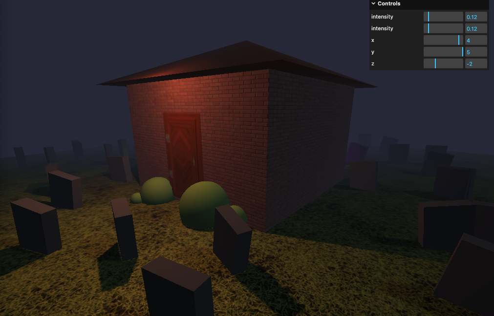

# Haunted House 

This is a mini project to learn how to deal with basic modeling components in Three.js:
- Texture
- Material
- Geometry
- Lights
... and etc

Big shout out to https://threejs-journey.com/ !

